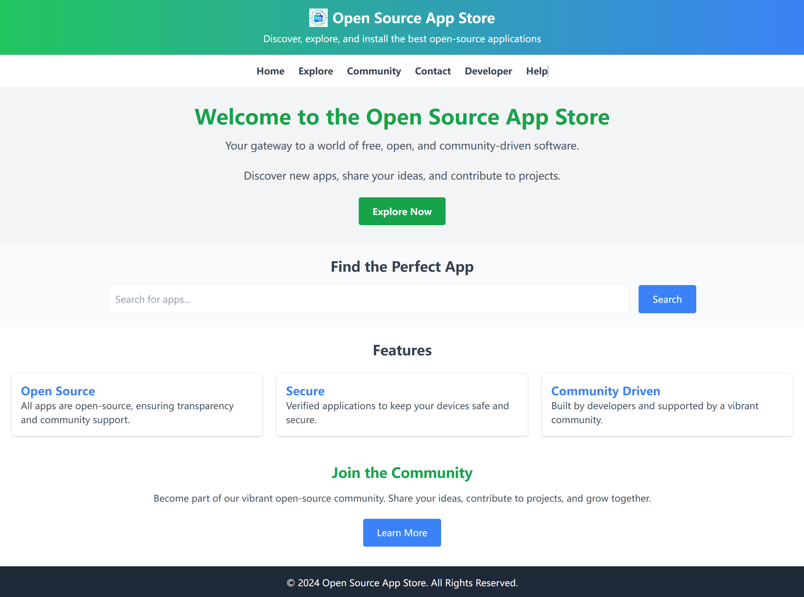
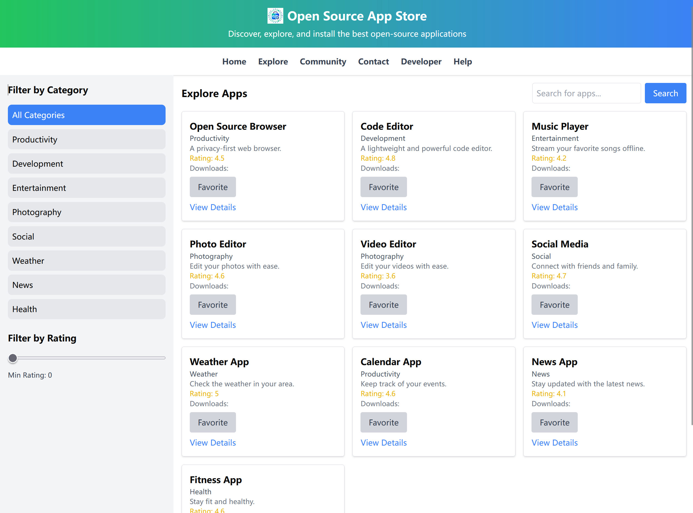

<p align='center'>
  
</p>

<p align='center'>
  English | <a href='./README.zh-CN.md'>简体中文</a>
</p>

# Open Source App Store

Welcome to the **Open Source App Store**! This project aims to provide a platform where users can explore, learn about, and engage with various open-source applications. 

## Table of Contents
- [Open Source App Store](#open-source-app-store)
  - [Table of Contents](#table-of-contents)
  - [Introduction](#introduction)
  - [Screenshots](#screenshots)
  - [Features](#features)
  - [Tech Stack](#tech-stack)
  - [Project Structure](#project-structure)
  - [Setup](#setup)
  - [Contributing](#contributing)
  - [License](#license)

## Introduction

This application is currently in development, utilizing mock data to showcase functionality. All pages are fully navigable and designed to give users an intuitive experience in exploring open-source software.

## Screenshots

1. **Home**



2. **Explore**



## Features

- **Home**: Introduction to the app store with highlights and featured apps.
- **Explore**: Browse through different categories of apps.
- **Community**: A space for users to share experiences, ask questions, and discuss apps.
- **Learn More**: Educational resources about open-source software development and usage.
- **Contact**: Get in touch with the project maintainers.
- **Help**: Assistance and FAQ for users.
- **App Details**: Detailed view of individual apps, including screenshots, descriptions, and installation instructions.
- **Developer Portal**: A hub for developers to manage their apps and engage with the community.

## Tech Stack

Our tech stack includes:

- **React**: For building user interfaces.
- **Vite**: As a development server and bundler for fast build times.
- **Shadcn UI**: For UI components.
- **TypeScript**: For type safety and better tooling.

## Project Structure

```plaintext
src/
├── components/          # Reusable UI components
│   ├── Header.jsx
│   ├── Navbar.jsx
│   ├── Hero.jsx
│   ├── SearchSection.jsx
│   ├── Features.jsx
│   ├── Community.jsx
│   └── Footer.jsx
├── pages/               # Page components for routing
│   ├── Home.jsx
│   ├── Explore.jsx
│   ├── Community.jsx
│   ├── LearnMore.jsx
│   ├── Contact.jsx
│   ├── Help.jsx
│   ├── AppDetails.jsx
│   └── DeveloperPortal.jsx
├── App.jsx              # Main application component
├── main.jsx             # Entry point of the application
└── index.css            # Global styles
```

## Setup

To get started with this project:

1. **Clone the repository:**
   ```bash
   git clone https://github.com/maxwellyu1024/osapp-react-vite
   ```

2. **Install dependencies:**
   ```bash
   cd osapp-react-vite
   pnpm install
   ```

3. **Run the development server:**
   ```bash
   pnpm run dev
   ```

   The app should now be running on `localhost:5173`.

## Contributing

We welcome contributions! Here's how you can contribute:

- **Report Bugs**: Use the issue tracker to report any bugs.
- **Feature Requests**: Suggest new features or improvements.
- **Pull Requests**: Submit pull requests with your enhancements or bug fixes.

Please ensure your contributions follow our [Code of Conduct](link-to-code-of-conduct).

## License

This project is licensed under the [MIT License](LICENSE).

---

Feel free to dive into the code, explore the app, or contribute to make this open-source app store even better!