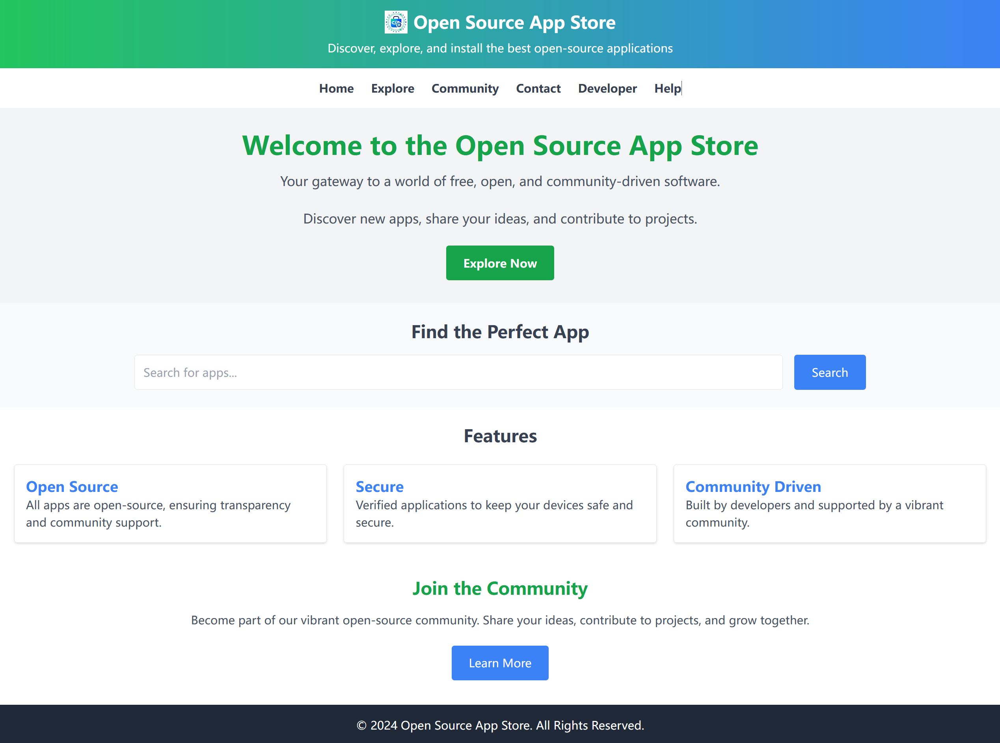
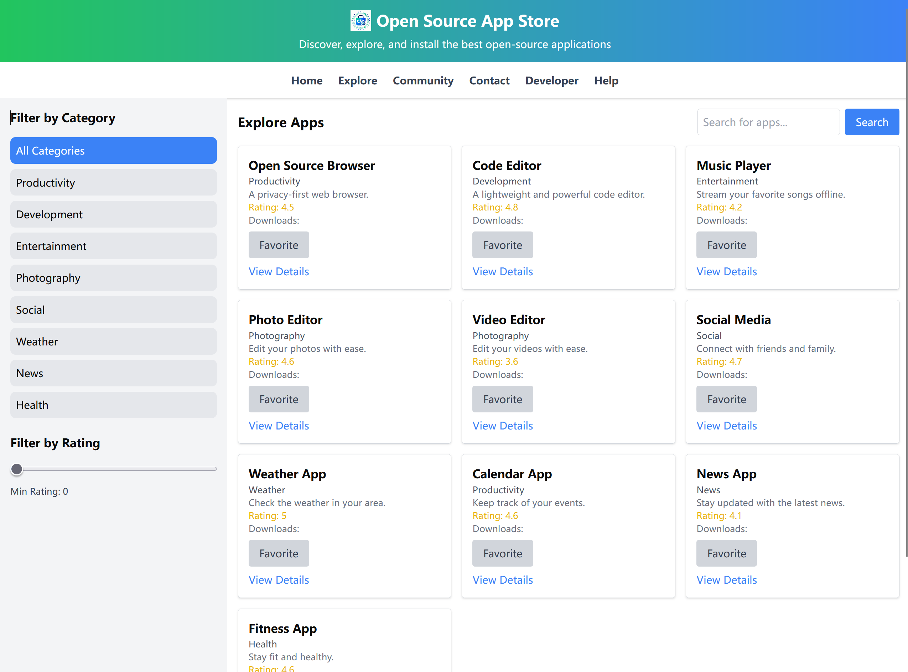

<p align='center'>
  
</p>

<p align='center'>
   <a href='./README.md'>English</a> | 简体中文
</p>

# 开源应用商店

欢迎来到**开源应用商店**！这个项目旨在为用户提供一个平台，探索、了解并与各种开源应用进行互动。

## 目录
- [开源应用商店](#开源应用商店)
  - [目录](#目录)
  - [简介](#简介)
  - [截图](#截图)
  - [功能](#功能)
  - [技术栈](#技术栈)
  - [项目结构](#项目结构)
  - [设置](#设置)
  - [贡献](#贡献)
  - [许可证](#许可证)

## 简介

这个应用目前还在开发中，使用模拟数据来展示功能。所有的页面都已经可以正常浏览，旨在为用户提供一个直观的体验来探索开源软件。

## 截图

1. **Home**



2. **Explore**



## 功能

- **首页**：介绍应用商店，展示特色和推荐的应用。
- **探索**：浏览不同类别的应用。
- **社区**：用户可以分享经验、提问和讨论应用。
- **了解更多**：提供关于开源软件开发和使用的教育资源。
- **联系我们**：与项目维护者联系。
- **帮助**：为用户提供帮助和常见问题解答。
- **应用详情**：查看单个应用的详细信息，包括截图、描述和安装指南。
- **开发者门户**：开发者管理他们的应用并与社区互动的地方。

## 技术栈

我们的技术栈包括：

- **React**：用于构建用户界面。
- **Vite**：作为开发服务器和打包工具，提供快速的构建时间。
- **Shadcn UI**：用于UI组件。
- **TypeScript**：提供类型安全和更好的工具支持。

## 项目结构

```plaintext
src/
├── components/          # 可复用的UI组件
│   ├── Header.jsx
│   ├── Navbar.jsx
│   ├── Hero.jsx
│   ├── SearchSection.jsx
│   ├── Features.jsx
│   ├── Community.jsx
│   └── Footer.jsx
├── pages/               # 路由对应的页面组件
│   ├── Home.jsx
│   ├── Explore.jsx
│   ├── Community.jsx
│   ├── LearnMore.jsx
│   ├── Contact.jsx
│   ├── Help.jsx
│   ├── AppDetails.jsx
│   └── DeveloperPortal.jsx
├── App.jsx              # 主应用程序组件
├── main.jsx             # 应用程序入口点
└── index.css            # 全局样式
```

## 设置

开始使用此项目：

1. **克隆仓库：**
   ```bash
   git clone https://github.com/maxwellyu1024/osapp-react-vite
   ```

2. **安装依赖：**
   ```bash
   cd osapp-react-vite
   pnpm install
   ```

3. **运行开发服务器：**
   ```bash
   pnpm run dev
   ```

   应用现在应该在 `localhost:5173` 上运行。

## 贡献

我们欢迎任何形式的贡献！以下是您可以贡献的方式：

- **报告问题**：使用问题跟踪器报告任何错误。
- **功能请求**：提出新的功能或改进建议。
- **提交Pull Request**：提交包含您增强或修复的Pull Request。

请确保您的贡献遵循我们的[行为准则](行为准则链接)。

## 许可证

此项目根据[MIT许可证](LICENSE)授权。

---

欢迎探索代码、体验应用，或者通过贡献来让这个开源应用商店变得更好！